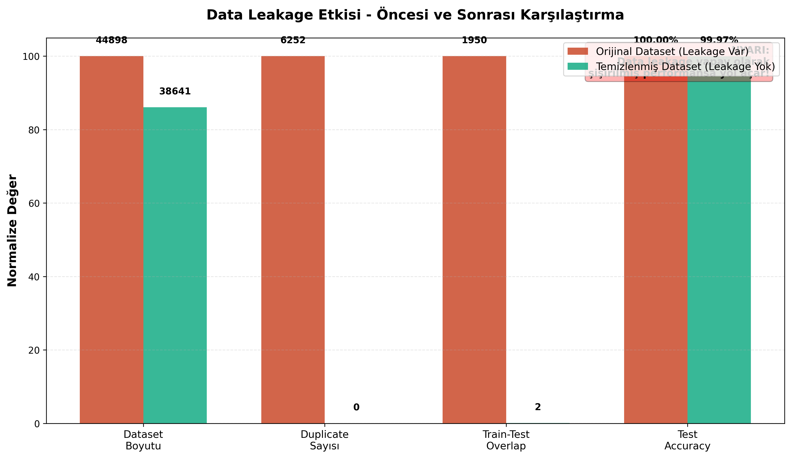
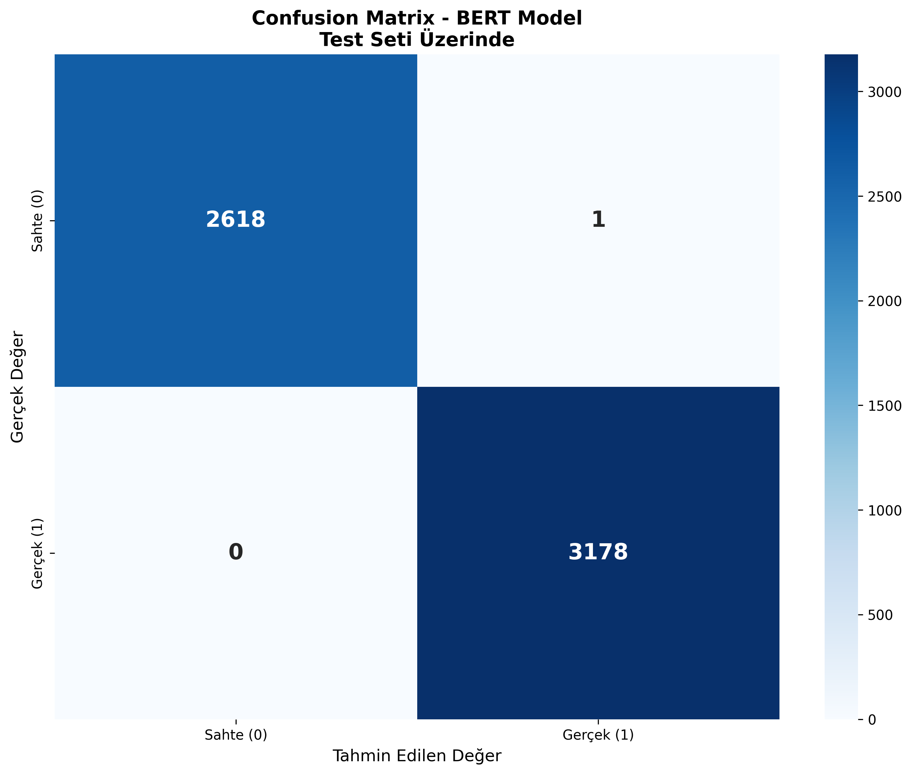
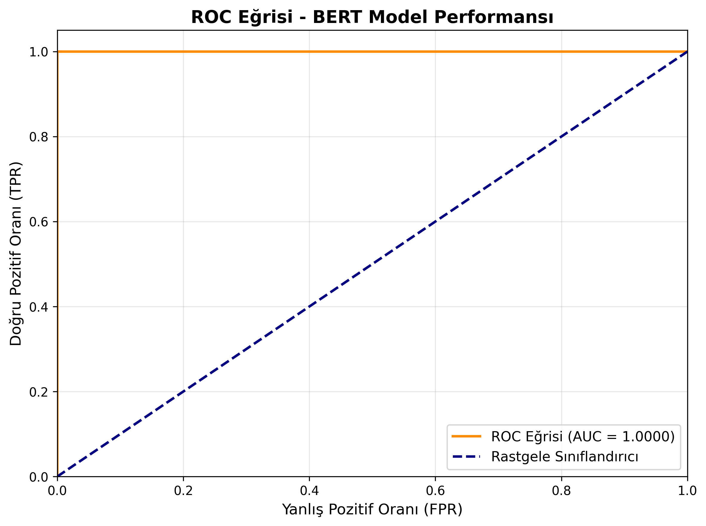

# Fake News Detection with BERT

Fine-tuning **BERT** (`bert-base-uncased`) to separate real and fake news articles in the ISOT dataset, with a pipeline built to remove data leakage before training.

## Why leakage matters here

The ISOT dataset contains many exact duplicate articles. With a random split the same article ends up in both training and test sets, and the model is partly graded on texts it has already seen.

This pipeline:

1. Finds duplicates with an MD5 hash of the article text and keeps only the first copy: **6,252 duplicates removed (13.9%)**, 44,898 → 38,646 articles
2. Splits **after** deduplication (stratified 70 / 15 / 15)
3. Preprocesses each split independently, so no statistics leak from test into training
4. Checks the overlap between splits again before training (train ∩ test: 1 article, down from 1,950)



## Results (test set, 5,797 articles)

| Metric | Score |
|---|---|
| Accuracy | 99.98% |
| Precision | 99.97% |
| F1 | 99.98% |
| ROC AUC | 1.000 |

| Confusion matrix | ROC curve |
|---|---|
|  |  |

Comparison with earlier work on ISOT is in [`results/literatur_karsilastirma.csv`](results/literatur_karsilastirma.csv). Most earlier studies did not report deduplication, so their test sets may overlap with training data.

## Training setup

| | |
|---|---|
| Model | bert-base-uncased (110 M parameters) |
| Input | Title + text, max 256 tokens |
| Epochs | 3, early stopping on validation F1 (patience 2) |
| Batch | 32 × 2 gradient accumulation = 64 |
| Optimizer | AdamW, lr 2e-5, weight decay 0.01, 500 warm-up steps, linear decay |
| Precision | FP16 |
| Hardware | RTX 3060 Laptop (6 GB), about 18 minutes |
| Seed | 42 (all libraries) |

## Running

1. Download the [ISOT Fake News dataset](https://www.kaggle.com/datasets/clmentbisaillon/fake-and-real-news-dataset) and put `Fake.csv` and `True.csv` in `data/`.
2. Install PyTorch for your CUDA version, then:
   ```bash
   pip install -r requirements.txt
   python fake_news_bert.py
   ```

The script writes the trained model, metrics, error analysis (false positives and negatives), training history and all figures to `outputs/`.

## Files

| | |
|---|---|
| `fake_news_bert.py` | Full pipeline: loading, deduplication, split, leakage check, training, evaluation, figures |
| `results/` | Metrics, hyperparameters, training history and figures from the published run |
